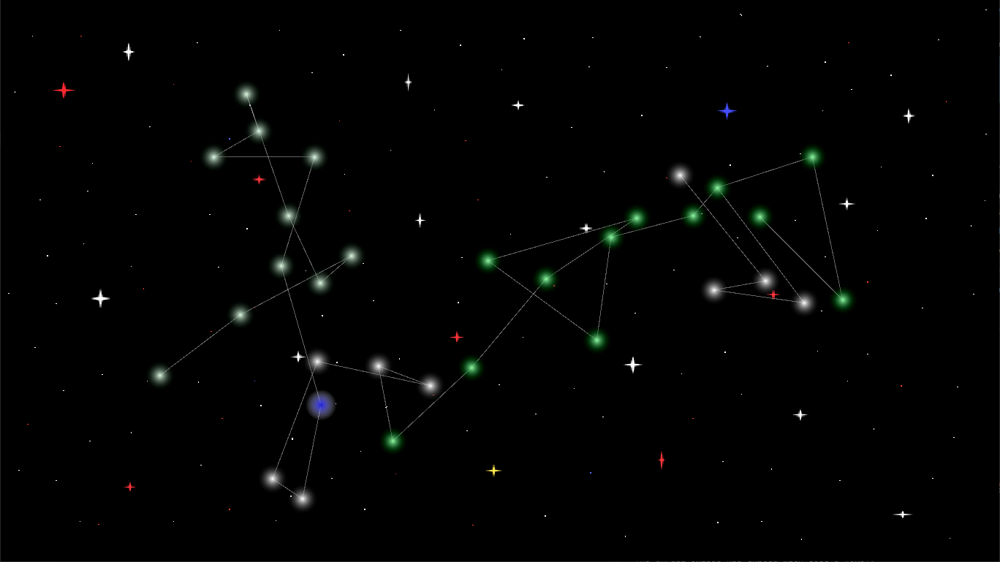

# At-Odds
Space 4x/rts game

# Building

You should use a package manager or something to install the following dependencies:

	sfml:x64 2.5.1
	tgui:x64 0.9.1
	boost-serialization:x64 1.75.0

Then, use premake to generate project files