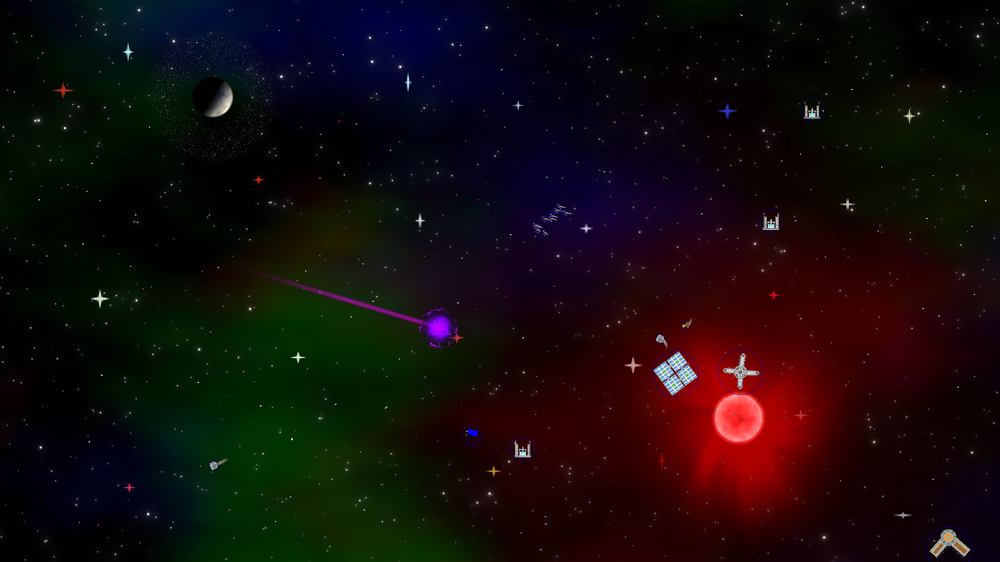

# At-Odds
Space 4x/rts game

# Building

Linux (Debian-based distros):

Run linux_build.sh

Windows:

Clone the vcpkg repo

	git clone https://github.com/microsoft/vcpkg

In the vcpkg folder, run bootstrap-vcpkg.bat

Run win_build.ps1 and then open the generated Visual Studio solution.

Dependencies:

	sfml:x64 2.5.1
	tgui:x64 0.9.1
	boost-serialization:x64 1.75.0
